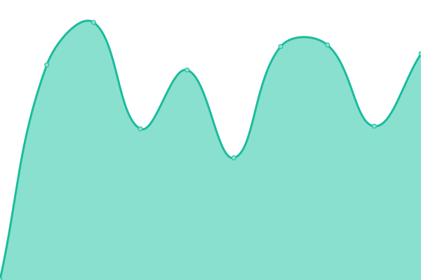

# [📈 Live Status](https://status.jayxtq.xyz): <!--live status--> **🟩 All systems operational**

This repository contains the open-source uptime monitor and status page for [Jay](https://jayxtq.xyz), powered by [Upptime](https://github.com/upptime/upptime).

With [Upptime](https://upptime.js.org), you can get your own unlimited and free uptime monitor and status page, powered entirely by a GitHub repository. We use [Issues](https://github.com/JayXTQ/uptime/issues) as incident reports, [Actions](https://github.com/JayXTQ/uptime/actions) as uptime monitors, and [Pages](https://status.jayxtq.xyz) for the status page.

<!--start: status pages-->
<!-- This summary is generated by Upptime (https://github.com/upptime/upptime) -->
<!-- Do not edit this manually, your changes will be overwritten -->
<!-- prettier-ignore -->
| URL | Status | History | Response Time | Uptime |
| --- | ------ | ------- | ------------- | ------ |
|  [Muusik](https://muusik.app) | 🟩 Up | [muusik.yml](https://github.com/JayXTQ/uptime/commits/HEAD/history/muusik.yml) | 

 216ms
     
 | 

<a href="https://status.jayxtq.xyz/history/muusik">100.00%</a>
    

|  [Muusik API](https://api.muusik.app) | 🟩 Up | [muusik-api.yml](https://github.com/JayXTQ/uptime/commits/HEAD/history/muusik-api.yml) | 

 461ms
     
 | 

<a href="https://status.jayxtq.xyz/history/muusik-api">100.00%</a>
    

|  [enka.cards](https://cards.enka.network) | 🟩 Up | [enka-cards.yml](https://github.com/JayXTQ/uptime/commits/HEAD/history/enka-cards.yml) | 

 1066ms
     
 | 

<a href="https://status.jayxtq.xyz/history/enka-cards">100.00%</a>
    

|  [cat-bot](https://catbot.jayxtq.xyz) | 🟩 Up | [cat-bot.yml](https://github.com/JayXTQ/uptime/commits/HEAD/history/cat-bot.yml) | 

 394ms
     
 | 

<a href="https://status.jayxtq.xyz/history/cat-bot">100.00%</a>
    

|  [dembed](https://dembed.page) | 🟩 Up | [dembed.yml](https://github.com/JayXTQ/uptime/commits/HEAD/history/dembed.yml) | 

 795ms
     
 | 

<a href="https://status.jayxtq.xyz/history/dembed">100.00%</a>
    

<!--end: status pages-->

[**Visit our status website →**](https://status.jayxtq.xyz)

## 📄 License

- Powered by: [Upptime](https://github.com/upptime/upptime)
- Code: [MIT](./LICENSE) © [Anand Chowdhary](https://anandchowdhary.com), supported by [Pabio](https://pabio.com)
- Data in the `./history` directory: [Open Database License](https://opendatacommons.org/licenses/odbl/1-0/)
